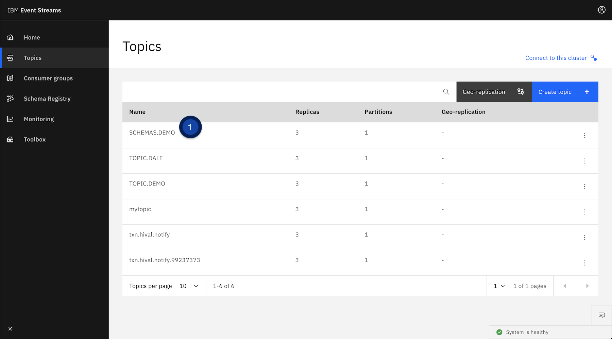
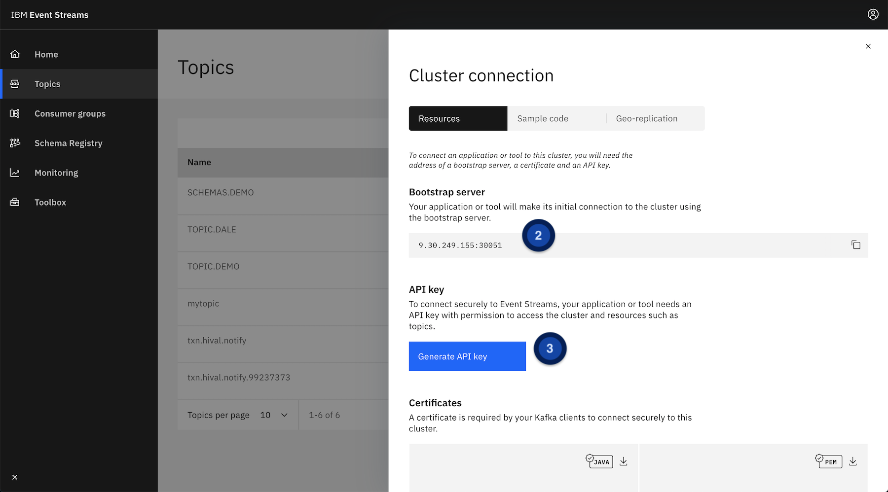
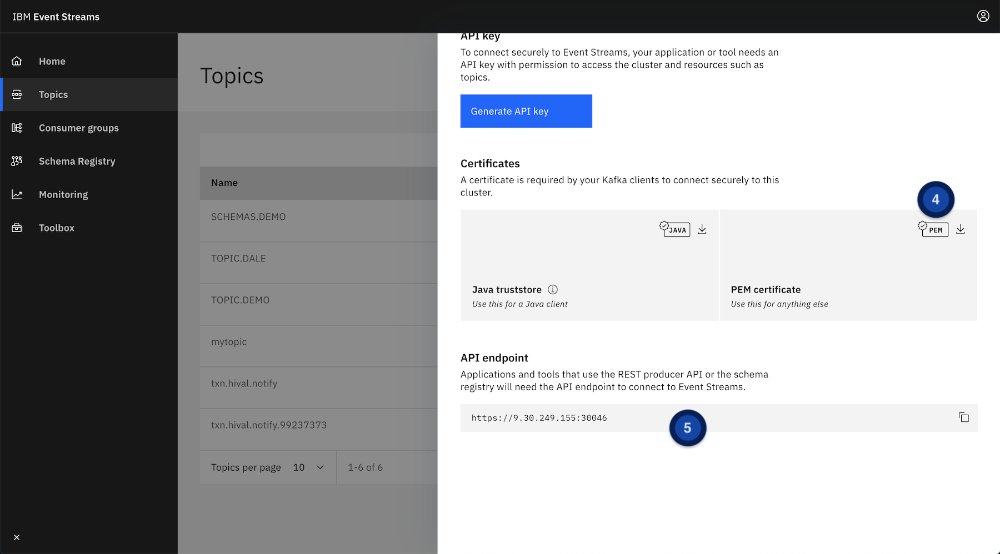
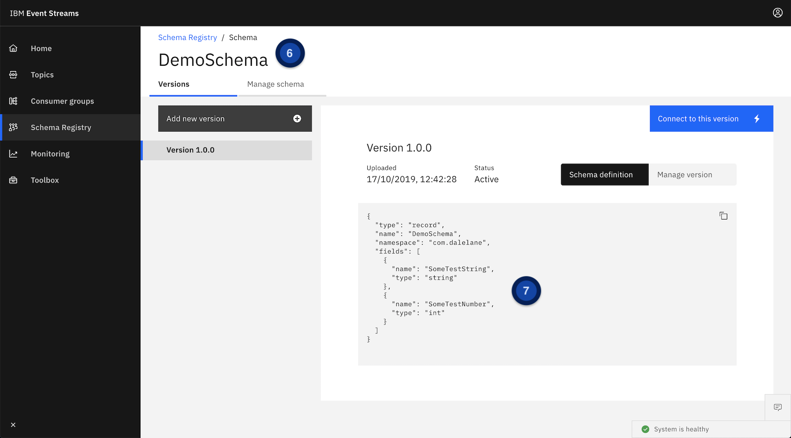

# Sample code for using schemas with Event Streams from Python

This project is a quick sample to help you get started with using schemas in IBM Event Streams from Python client applications.

## Pre-requisites

* You have a **Kafka topic** in an Event Streams cluster
* You have an **Avro schema** stored in the Event Streams Schema Registry
* You have **Python 3** and want to produce/consume messages serialized with the schema
* You have installed the Python **dependencies** using `pip3 install -r requirements.txt`

## Setting up

To use it, you need to populate `config.py` with details for your particular Kafka topic and schema to use.

The screenshots below are meant to help you give you a pointer where to find what you need.

(_The numbers on the screenshots match up with the list below, as well as the comments in `config.py`._)

1. The **name of the topic** that you want to send/receive messages to

2. The **bootstrap server** address that Kafka clients should connect to.

3. The **API key** that clients can use to authenticate with Event Streams.

4. The **certificate PEM file** for making a connection to Event Streams.

5. The **REST API address** for retrieving the schema from the Event Streams Schema Registry.

6. The **ID and version for the schema** to use in your client.

7. A **test message** that has fields consistent with your schema definition.

## Running

Run `test_producer.py` to send a test message

Run `test_consumer.py` to receive messages and display the deserialized contents.

## Questions?

If I can help with any of this, please create an issue to let me know.
